# Ejercicios del modelo E-R

## Ejercicio 1. 
Un hospital registra informacion de sus pacientes: 

>De cada paciente se almacena: 
- Numero de paciente que lo identifica 
- Nombre 
- Fecha de Nacimiento 

> De cada expediente medico se almacena
- Numero de expediente 
- Fecha de apertura 
- Tipo de sangre 

> Reglas del negocio 
1. Cada paciente debe tener exactamente un expediente medico 
2. Cada expediente medico pertenece a un unico paciente 
3. No puede existir un expediente sin paciente 
4. No puede existir un paciente sin expediente 

>  Que se debe realizar:
- Identificar las entidades 
- Identificar atributos
- DIbujar las rlaciones 
- Determinar la cardinalidad
- determinar la participacion de cada entidad 

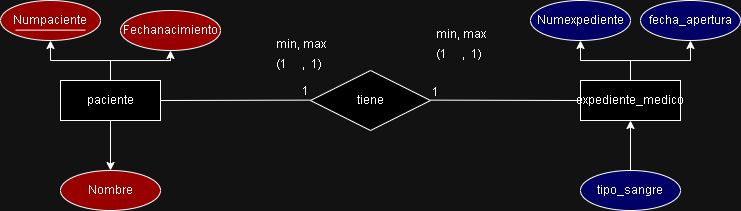
## Racional

## Ejercicio 2

una universidd administra profesores y cursos

>de cada profesor se almacena

- numero de profesor id 
- nombre 
- especialidad  

> De cada **curso** se almacena

- Numero de Curso
- Nombre del curso
- Creditos

>Reglas de negocio

1. Un profesor puede impartir varios cursos
2.  un curso solo pued ser impartido por un profesor
3. puede exixtir un profesor que actualmente no imparte cursos
4. Todo curso debe estar asignado a un profesor

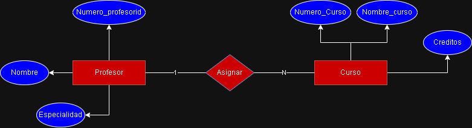
## Racional

## ejercicio 3

Una escuela administra alumnos y materias
> De cada **alumno** se almacena 
- Matricula
- Nombre
- Semestre
> De cada **Materia** se almacena
- Clave de la materia
- Nombre de la materia
- Creditos
> Reglas del negocio

1. Un alumno puede inscribirse en varias materias
2. Un a materia puede tener muchos alumnos inscritos
3. Puede exixtir una materia sin alumnos inscritos
4. Todo alumno debe estar inscrito almenos a una materia
     - Fecha de inscripcion
     - Calificacion final

 Nota: a la relacion nombrarla **INSCRITO**     
 
 ## RACIONAL
  

## ejercicio 4

una empresa dedicada a las ventas al por mayor necesita registrar lo siguiente 

> Para los clientes

- Numero de cliente
- NOmbre (El cual es una persona moral)
- Pedidos
- Numero de pedido
- Fecha de pedido

>Pedido
- Nombre de producto
- Nombre
- Precio
>Reglas del negocio
1. Un cliente puede realizar muchos pedidos
2. Cada pedido pertenece a un solo cliente
3. Un pedido contiene varios productos
4. Un producto puede apraecer en munchos pedidos
5. Un pedido debe contener almenos un producto
6. Un poducto puede no haber sido vendido
7. El detalle del pedido no exixte sin pedido
8. El detalle del pedido no exixte sin producto
9. El detalle almacena la cantidad vendida y el precio de venta 

 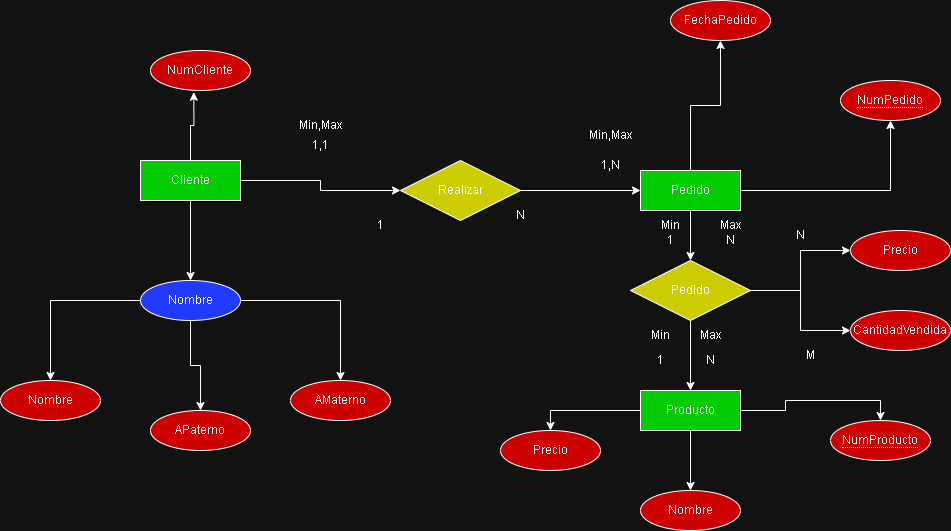
 ## RACIONAL
 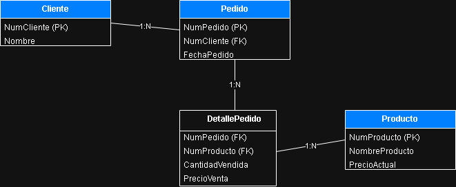

 ## Ejercicio 5

una empresa necesita registrar lo siguiente

> Para los departamentos

- Nombre de departamento
- Número de departamento
- Gerente (El cual es un empleado particular)
- Fecha de inicio (Cuando el empleado comenzó a dirigir el departamento)
- Ubicaciones

> Para los proyectos

- Nombre de proyecto
- Número de proyecto
- Ubicación de proyecto

> Para los empleados

- Nombre
- Número de Seguro Social
- Dirección
- Salario
- Sexo (Género)
- Fecha de nacimiento
- Horas por semana (Que el empleado trabaja en cada proyecto)
- Supervisor directo (El cual es otro empleado)

> Para los dependientes

- Nombre de pila
- Sexo
- Fecha de nacimiento
- Parentesco

> Reglas del negocio

1. La empresa está organizada en departamentos
2. Cada departamento tiene un nombre único, un número único y un gerente
3. Un departamento puede tener varias ubicaciones
4. Un departamento controla un número de proyectos
5. Cada proyecto tiene un nombre único, un número único y una sola ubicación
6. Un empleado está asignado a un solo departamento
7. Un empleado puede trabajar en varios proyectos, los cuales no necesariamente son controlados por el mismo departamento
8. Se debe llevar el control de las horas semanales actuales que un empleado trabaja en cada proyecto
9. Se debe llevar el control del supervisor directo de cada empleado
10. Se desea llevar el control de los dependientes de cada empleado para fines de seguros

## RACIONAL
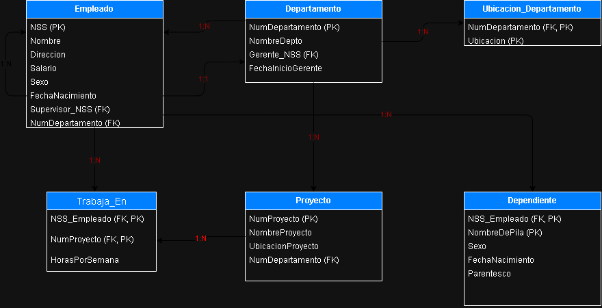

## Ejercicio 6 

## Diagrama ER
 
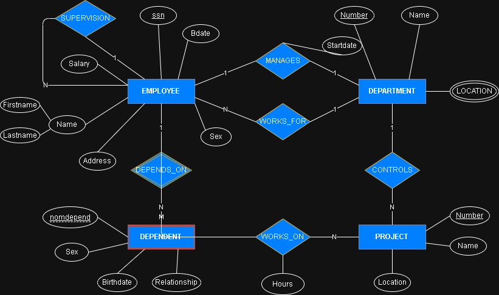

## Racional
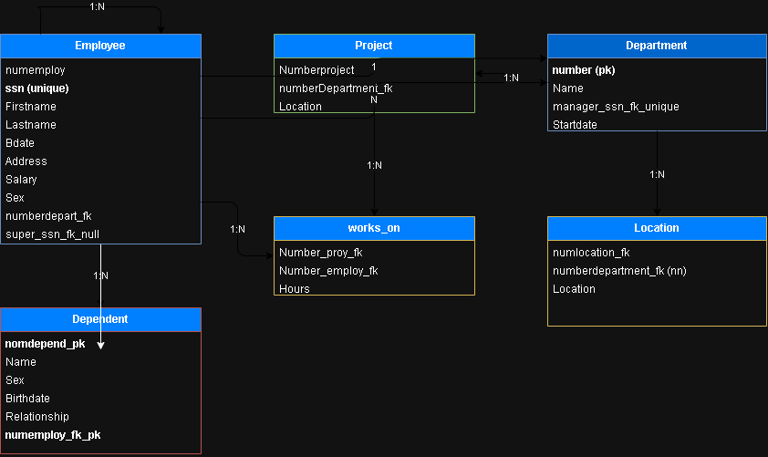

## Ejercicio 7

## Diagrama ER
 
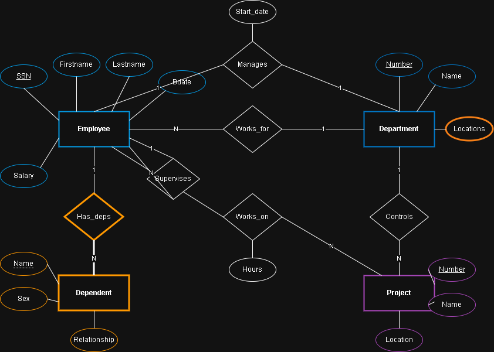

## Racional
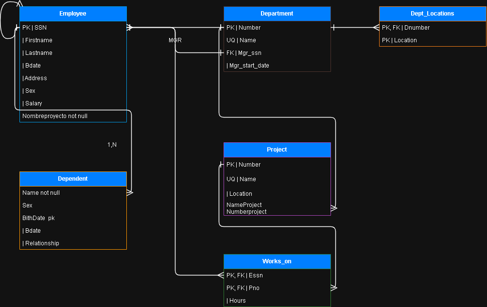

## Ejemplos mejorados de clase

## ER
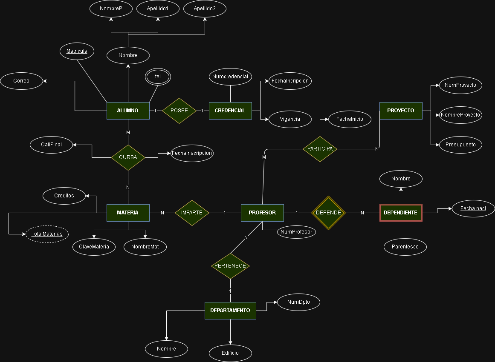

## Racional
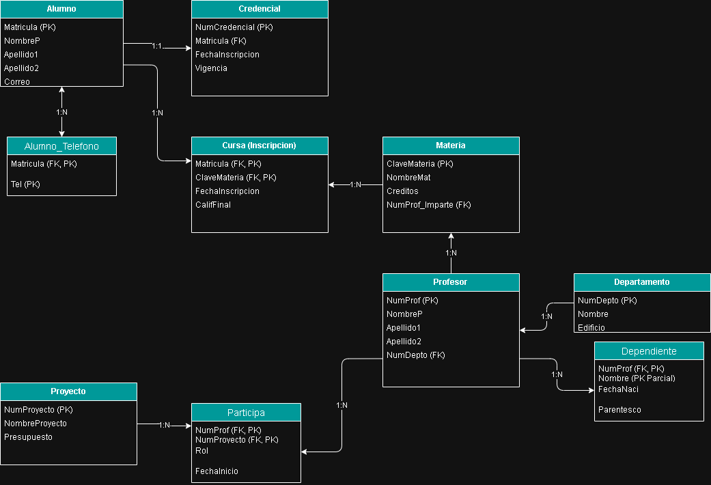