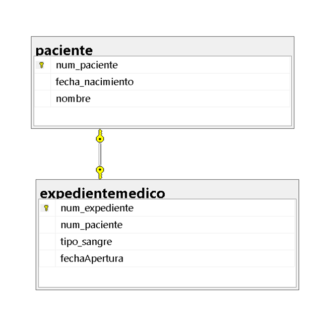

## Ejercicio 1

Un hospital registra información de sus pacientes:

> De cada paciente se almacena:
- Número de paciente que lo identifica
- Nombre
- Fecha de Nacimiento


- Número de expediente
- Fecha de apertura
- Tipo de sangre

> Reglas del negocio:
1. Cada paciente debe tener exactamente un expediente médico.
2. Cada expediente médico pertenece a un único paciente.
3. No puede existir un expediente sin paciente.
4. No puede existir un paciente sin expediente.

> ¿Qué se debe realizar?
- Identificar las entidades.
- Identificar atributos.
- Dibujar las relaciones.
- Determinar la cardinalidad.
- Determinar la participación de cada entidad.


## Relacional


### Código SQL
```sql
CREATE DATABASE hospital_control;
GO

USE hospital_control;
GO

CREATE TABLE paciente (
    num_paciente INT PRIMARY KEY,
    nombre VARCHAR(100) NOT NULL,
    fecha_nacimiento DATE NOT NULL
);
GO
CREATE TABLE expedientemedico (
    num_expediente INT PRIMARY KEY,
    num_paciente INT NOT NULL UNIQUE,
    tipo_sangre VARCHAR(5) NOT NULL,
    fechaApertura DATE NOT NULL,
    FOREIGN KEY (num_paciente) REFERENCES paciente(num_paciente)
);
GO
```
## Relacional de SQL

