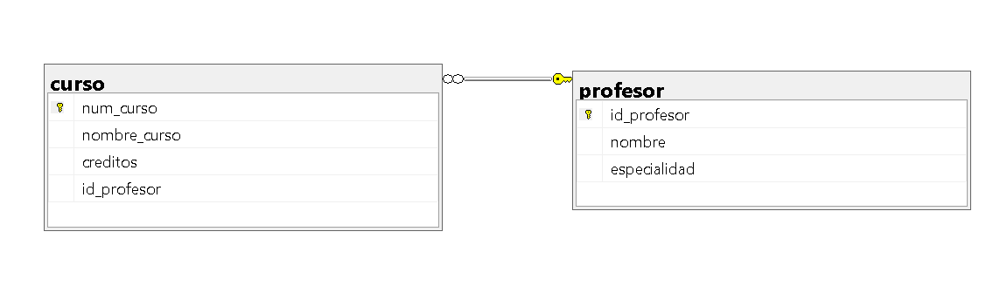

## Ejercicio 2

Una universidad administra profesores y cursos:

> De cada profesor se almacena:
- Número de profesor (ID)
- Nombre
- Especialidad

> De cada curso se almacena:
- Número de Curso
- Nombre del curso
- Créditos

> Reglas de negocio:
1. Un profesor puede impartir varios cursos.
2. Un curso solo puede ser impartido por un profesor.
3. Puede existir un profesor que actualmente no imparte cursos.
4. Todo curso debe estar asignado a un profesor.

> ¿Qué se debe realizar?
- Identificar las entidades.
- Identificar atributos.
- Dibujar las relaciones.
- Determinar la cardinalidad.
- Determinar la participación de cada entidad.

!

## Relacional


### Código SQL
```sql
USE universidad;
GO

CREATE TABLE profesor (
    id_profesor INT PRIMARY KEY,
    nombre VARCHAR(100) NOT NULL,
    especialidad VARCHAR(100) NOT NULL
);
GO

CREATE TABLE curso (
    num_curso INT PRIMARY KEY,
    nombre_curso VARCHAR(100) NOT NULL UNIQUE,
    creditos INT NOT NULL CHECK (creditos > 0),
    id_profesor INT NOT NULL,
    FOREIGN KEY (id_profesor) REFERENCES profesor(id_profesor) ON DELETE CASCADE
);
GO

```

## Relacional SQL

