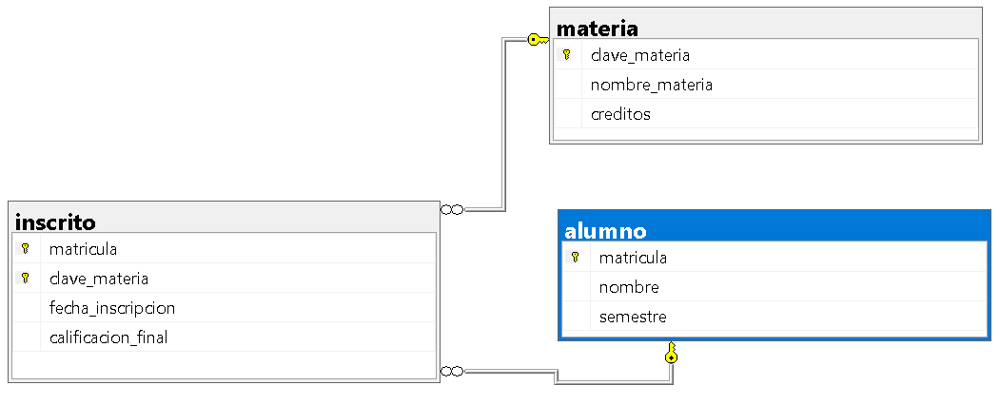

## Ejercicio 3

Una escuela administra alumnos y materias:

> De cada alumno se almacena:
- Matrícula
- Nombre
- Semestre

> De cada materia se almacena:
- Clave de la materia
- Nombre de la materia
- Créditos

> Reglas del negocio:
1. Un alumno puede inscribirse en varias materias.
2. Una materia puede tener muchos alumnos inscritos.
3. Puede existir una materia sin alumnos inscritos.
4. Todo alumno debe estar inscrito al menos a una materia.
5. Se debe almacenar la fecha de inscripción y la calificación final de la materia.

> ¿Qué se debe realizar?
- Identificar las entidades
- Identificar atributos
- Dibujar las relaciones
- Determinar la cardinalidad
- Determinar la participación de cada entidad


### Código SQL
```sql
CREATE TABLE alumno (
    matricula INT PRIMARY KEY,
    nombre VARCHAR(100) NOT NULL,
    semestre INT NOT NULL
);

CREATE TABLE materia (
    clave_materia VARCHAR(20) PRIMARY KEY,
    nombre_materia VARCHAR(100) NOT NULL,
    creditos INT NOT NULL
);

CREATE TABLE inscrito (
    matricula INT NOT NULL,
    clave_materia VARCHAR(20) NOT NULL,
    fecha_inscripcion DATE NOT NULL,
    calificacion_final DECIMAL(4,2),
    PRIMARY KEY (matricula, clave_materia),
    FOREIGN KEY (matricula) REFERENCES alumno(matricula),
    FOREIGN KEY (clave_materia) REFERENCES materia(clave_materia)
);

```

## Relacional SQL

