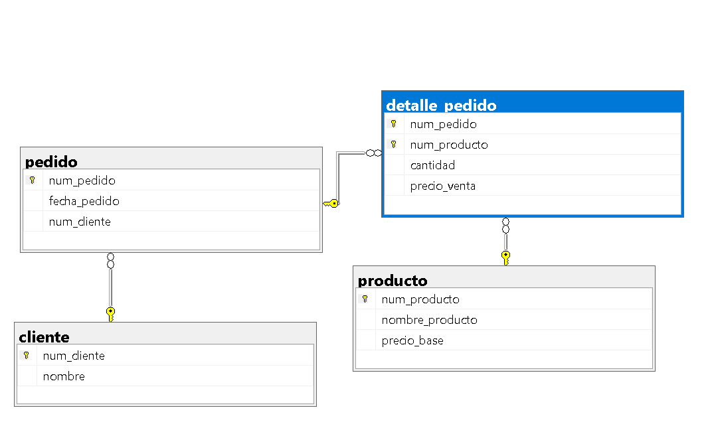

## Ejercicio 4

Una empresa dedicada a las ventas al por mayor necesita registrar lo siguiente:

> De cada cliente se almacena:
- Número de cliente
- Nombre (Persona moral)

> De cada pedido se almacena:
- Número de pedido
- Fecha de pedido

> De cada producto se almacena:
- Número de producto
- Nombre
- Precio

> Reglas del negocio:
1. Un cliente puede realizar muchos pedidos.
2. Cada pedido pertenece a un solo cliente.
3. Un pedido contiene varios productos.
4. Un producto puede aparecer en muchos pedidos.
5. Un pedido debe contener al menos un producto.
6. Un producto puede no haber sido vendido.
7. El detalle del pedido almacena la cantidad vendida y el precio de venta.

> ¿Qué se debe realizar?
- Identificar las entidades
- Identificar atributos
- Dibujar las relaciones
- Determinar la cardinalidad
- Determinar la participación de cada entidad



### Código SQL
```sql
CREATE DATABASE ventas_db;
GO

USE ventas_db;
GO

CREATE TABLE cliente (
    num_cliente INT PRIMARY KEY,
    nombre VARCHAR(150) NOT NULL
);
GO

CREATE TABLE producto (
    num_producto INT PRIMARY KEY,
    nombre_producto VARCHAR(100) NOT NULL,
    precio_base DECIMAL(10,2) NOT NULL
);
GO

CREATE TABLE pedido (
    num_pedido INT PRIMARY KEY,
    fecha_pedido DATE NOT NULL,
    num_cliente INT NOT NULL,
    FOREIGN KEY (num_cliente) REFERENCES cliente(num_cliente)
);
GO

CREATE TABLE detalle_pedido (
    num_pedido INT NOT NULL,
    num_producto INT NOT NULL,
    cantidad INT NOT NULL,
    precio_venta DECIMAL(10,2) NOT NULL,
    PRIMARY KEY (num_pedido, num_producto),
    FOREIGN KEY (num_pedido) REFERENCES pedido(num_pedido),
    FOREIGN KEY (num_producto) REFERENCES producto(num_producto)
);
GO

```
## RELACIONAL SQL

