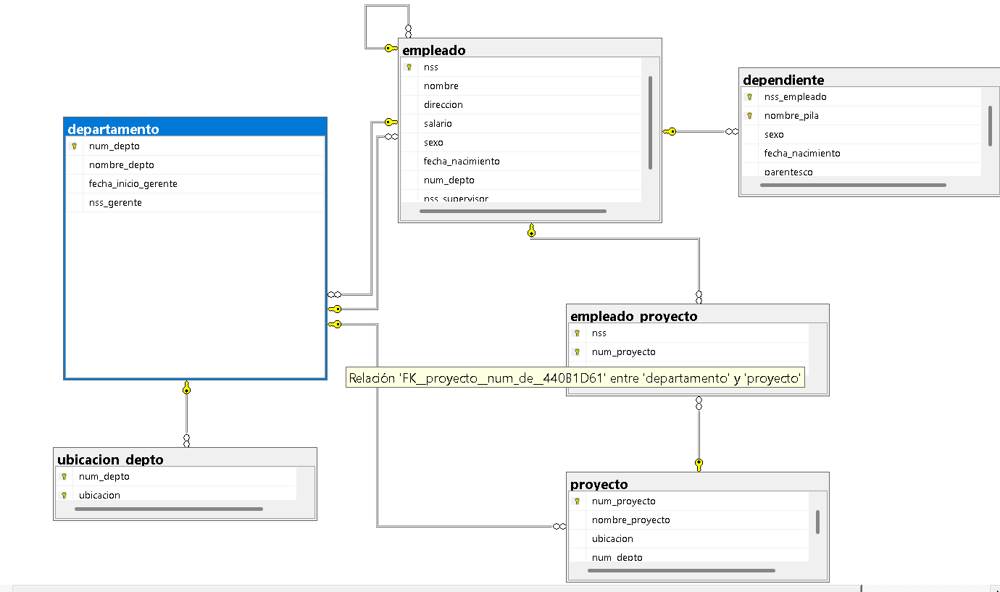

Markdown
## Ejercicio 5

Una empresa necesita registrar lo siguiente para su control administrativo:

> De los departamentos se almacena:
- Nombre de departamento (único)
- Número de departamento (único)
- Gerente (empleado particular)
- Fecha de inicio de gestión
- Ubicaciones

> De los proyectos se almacena:
- Nombre de proyecto (único)
- Número de proyecto (único)
- Ubicación de proyecto

> De los empleados se almacena:
- Nombre
- Número de Seguro Social (NSS)
- Dirección
- Salario
- Sexo
- Fecha de nacimiento
- Horas por semana (trabajadas en cada proyecto)
- Supervisor directo (otro empleado)

> De los dependientes se almacena:
- Nombre de pila
- Sexo
- Fecha de nacimiento
- Parentesco

> Reglas del negocio:
1. Un empleado está asignado a un solo departamento.
2. Un empleado puede trabajar en varios proyectos.
3. Se lleva el control de las horas semanales actuales por proyecto.
4. Se lleva el control del supervisor directo de cada empleado.
5. Se lleva el control de los dependientes por fines de seguro.

> ¿Qué se debe realizar?
- Identificar las entidades
- Identificar atributos
- Dibujar las relaciones
- Determinar la cardinalidad
- Determinar la participación de cada entidad



### Código SQL
```sql
CREATE DATABASE empresa;
GO

USE empresa;
GO

CREATE TABLE departamento(
    num_depto INT PRIMARY KEY,
    nombre_depto VARCHAR(100) NOT NULL UNIQUE,
    fecha_inicio_gerente DATE
);
GO

CREATE TABLE ubicacion_depto(
    num_depto INT NOT NULL,
    ubicacion VARCHAR(100) NOT NULL,
    PRIMARY KEY (num_depto, ubicacion),
    FOREIGN KEY (num_depto) REFERENCES departamento(num_depto)
);
GO

CREATE TABLE empleado(
    nss INT PRIMARY KEY,
    nombre VARCHAR(100) NOT NULL,
    direccion VARCHAR(150),
    salario DECIMAL(10,2) NOT NULL,
    sexo CHAR(1) NOT NULL,
    fecha_nacimiento DATE NOT NULL,
    num_depto INT NOT NULL,
    nss_supervisor INT,
    FOREIGN KEY (num_depto) REFERENCES departamento(num_depto),
    FOREIGN KEY (nss_supervisor) REFERENCES empleado(nss)
);
GO

ALTER TABLE departamento
ADD nss_gerente INT,
FOREIGN KEY (nss_gerente) REFERENCES empleado(nss);
GO

CREATE TABLE proyecto(
    num_proyecto INT PRIMARY KEY,
    nombre_proyecto VARCHAR(100) NOT NULL UNIQUE,
    ubicacion VARCHAR(100) NOT NULL,
    num_depto INT NOT NULL,
    FOREIGN KEY (num_depto) REFERENCES departamento(num_depto)
);
GO

CREATE TABLE empleado_proyecto(
    nss INT NOT NULL,
    num_proyecto INT NOT NULL,
    horas_semana DECIMAL(4,1) NOT NULL,
    PRIMARY KEY (nss, num_proyecto),
    FOREIGN KEY (nss) REFERENCES empleado(nss),
    FOREIGN KEY (num_proyecto) REFERENCES proyecto(num_proyecto)
);
GO

CREATE TABLE dependiente(
    nss_empleado INT NOT NULL,
    nombre_pila VARCHAR(50) NOT NULL,
    sexo CHAR(1) NOT NULL,
    fecha_nacimiento DATE NOT NULL,
    parentesco VARCHAR(50) NOT NULL,
    PRIMARY KEY (nss_empleado, nombre_pila),
    FOREIGN KEY (nss_empleado) REFERENCES empleado(nss)
);
GO

```
## Relacional SQL

