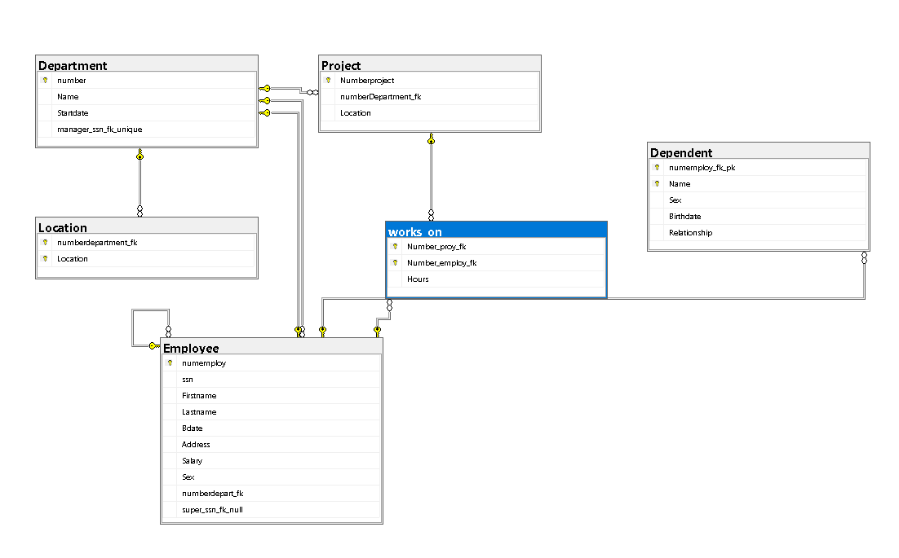

## Ejercicio 6

Esquema organizacional en inglés (Employee / Department / Project / Works_On):

> De los departamentos se almacena:
- Number (Primary Key)
- Name
- Startdate
- Manager

> De las ubicaciones (Location) se almacena:
- Numberdepartment_fk
- Location

> De los empleados (Employee) se almacena:
- Numemploy (Primary Key)
- SSN (Unique)
- Firstname / Lastname
- Bdate / Address / Salary / Sex
- Numberdepart_fk
- Super_ssn_fk_null (Supervisor)

> De los proyectos (Project) se almacena:
- Numberproject (Primary Key)
- NumberDepartment_fk
- Location

> De la relación de trabajo (Works_on) se almacena:
- Number_proy_fk
- Number_employ_fk
- Hours

> De los dependientes (Dependent) se almacena:
- Numemploy_fk_pk
- Name
- Sex / Birthdate / Relationship

> ¿Qué se debe realizar?
- Identificar las entidades
- Identificar atributos
- Dibujar las relaciones
- Determinar la cardinalidad
- Determinar la participación de cada entidad


### Código SQL
```sql
CREATE DATABASE empresa_ejercicio6;
GO

USE empresa_ejercicio6;
GO

CREATE TABLE Department(
    number INT PRIMARY KEY,
    Name VARCHAR(100) NOT NULL,
    Startdate DATE
);
GO

CREATE TABLE Location(
    numberdepartment_fk INT NOT NULL,
    Location VARCHAR(100) NOT NULL,
    PRIMARY KEY (numberdepartment_fk, Location),
    FOREIGN KEY (numberdepartment_fk) REFERENCES Department(number)
);
GO

CREATE TABLE Employee(
    numemploy INT PRIMARY KEY,
    ssn CHAR(9) NOT NULL UNIQUE,
    Firstname VARCHAR(50) NOT NULL,
    Lastname VARCHAR(50) NOT NULL,
    Bdate DATE NOT NULL,
    Address VARCHAR(150),
    Salary DECIMAL(10,2) NOT NULL,
    Sex CHAR(1) NOT NULL,
    numberdepart_fk INT NOT NULL,
    super_ssn_fk_null INT,
    FOREIGN KEY (numberdepart_fk) REFERENCES Department(number),
    FOREIGN KEY (super_ssn_fk_null) REFERENCES Employee(numemploy)
);
GO

ALTER TABLE Department
ADD manager_ssn_fk_unique INT UNIQUE,
FOREIGN KEY (manager_ssn_fk_unique) REFERENCES Employee(numemploy);
GO

CREATE TABLE Project(
    Numberproject INT PRIMARY KEY,
    numberDepartment_fk INT NOT NULL,
    Location VARCHAR(100) NOT NULL,
    FOREIGN KEY (numberDepartment_fk) REFERENCES Department(number)
);
GO

CREATE TABLE works_on(
    Number_proy_fk INT NOT NULL,
    Number_employ_fk INT NOT NULL,
    Hours DECIMAL(4,1) NOT NULL,
    PRIMARY KEY (Number_proy_fk, Number_employ_fk),
    FOREIGN KEY (Number_proy_fk) REFERENCES Project(Numberproject),
    FOREIGN KEY (Number_employ_fk) REFERENCES Employee(numemploy)
);
GO

CREATE TABLE Dependent(
    numemploy_fk_pk INT NOT NULL,
    Name VARCHAR(50) NOT NULL,
    Sex CHAR(1) NOT NULL,
    Birthdate DATE NOT NULL,
    Relationship VARCHAR(50) NOT NULL,
    PRIMARY KEY (numemploy_fk_pk, Name),
    FOREIGN KEY (numemploy_fk_pk) REFERENCES Employee(numemploy)
);
GO

```

## Relacional
