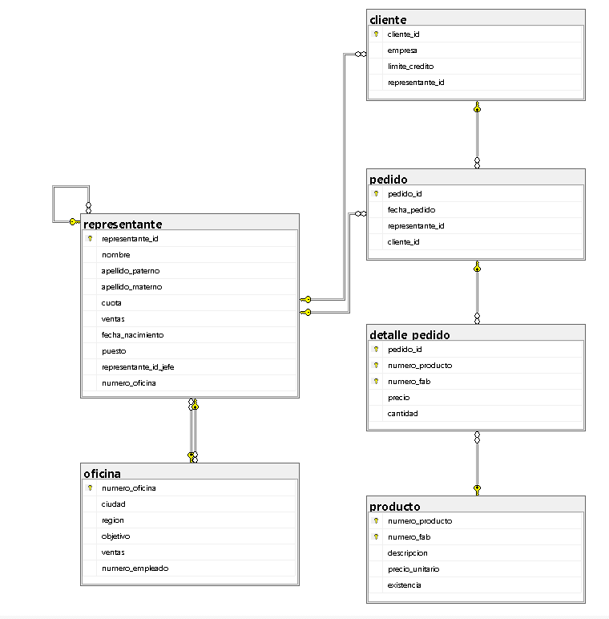

## Ejercicio Comercializadora

Sistema de gestión para el control de inventario, ventas, oficinas y representantes:

> De cada producto se almacena:
- Número de producto y número de fabricante (Llave primaria compuesta)
- Descripción
- Precio unitario
- Existencia

> De cada oficina se almacena:
- Número de oficina (Autoincrementable)
- Ciudad (Única)
- Región (Este / Oeste)
- Objetivo y ventas
- Número de empleado (Representante a cargo)

> De cada cliente se almacena:
- Cliente ID (Autoincrementable)
- Empresa (Única)
- Límite de crédito
- Representante asignado

> De cada representante se almacena:
- Representante ID (Autoincrementable)
- Nombre y apellidos
- Cuota y ventas
- Fecha de nacimiento y puesto
- ID del jefe (Autorrelación) y número de oficina

> De cada pedido y su detalle se almacena:
- Pedido ID (Autoincrementable)
- Fecha del pedido
- Cliente y representante
- Cantidad y precio de venta por producto

> ¿Qué se debe realizar?
- Identificar las entidades
- Identificar atributos
- Dibujar las relaciones
- Determinar la cardinalidad
- Determinar la participación de cada entidad


### Código SQL
```sql
CREATE DATABASE comercializadora;
GO

USE comercializadora;
GO

-- 1. Tabla PRODUCTO
CREATE TABLE producto (
    numero_producto CHAR(3) NOT NULL,
    numero_fab CHAR(5) NOT NULL,
    descripcion VARCHAR(50) NOT NULL,
    precio_unitario DECIMAL(10,2) NOT NULL,
    existencia INT NOT NULL,
    CONSTRAINT pk_producto PRIMARY KEY (numero_producto, numero_fab),
    CONSTRAINT uq_producto_descripcion UNIQUE (descripcion),
    CONSTRAINT ck_producto_precio_unitario CHECK (precio_unitario > 0.0),
    CONSTRAINT ck_producto_existencia CHECK (existencia BETWEEN 1 AND 1000)
);
GO

-- 2. Tabla OFICINA
CREATE TABLE oficina (
    numero_oficina INT NOT NULL IDENTITY(1,1),
    ciudad VARCHAR(30) NOT NULL,
    region VARCHAR(20),
    objetivo DECIMAL(10,2) NOT NULL,
    ventas DECIMAL(10,2) NOT NULL,
    numero_empleado INT NOT NULL,
    CONSTRAINT pk_oficina PRIMARY KEY (numero_oficina),
    CONSTRAINT uq_oficina_ciudad UNIQUE (ciudad),
    CONSTRAINT ck_oficina_region CHECK (region IN ('Este', 'Oeste', 'este', 'oeste'))
);
GO

-- 3. Tabla CLIENTE
CREATE TABLE cliente (
    cliente_id INT NOT NULL IDENTITY(1,1),
    empresa VARCHAR(30) NOT NULL,
    limite_credito DECIMAL(10,2) NOT NULL,
    representante_id INT NOT NULL,
    CONSTRAINT pk_cliente PRIMARY KEY (cliente_id),
    CONSTRAINT uq_cliente_empresa UNIQUE (empresa),
    CONSTRAINT ck_cliente_limite_credito CHECK (limite_credito BETWEEN 1000 AND 100000)
);
GO

-- 4. Tabla REPRESENTANTE
CREATE TABLE representante (
    representante_id INT NOT NULL IDENTITY(1,1),
    nombre VARCHAR(20) NOT NULL,
    apellido_paterno VARCHAR(18) NOT NULL,
    apellido_materno VARCHAR(18) NULL,
    cuota DECIMAL(10,2) NOT NULL,
    ventas DECIMAL(10,2),
    fecha_nacimiento DATE NOT NULL,
    puesto VARCHAR(30) NOT NULL,
    representante_id_jefe INT,
    numero_oficina INT NOT NULL,
    CONSTRAINT pk_representante PRIMARY KEY (representante_id),
    CONSTRAINT ck_representante_cuota CHECK (cuota > 0.0),
    CONSTRAINT ck_representante_ventas CHECK (ventas > 0.0),
    CONSTRAINT fk_representante_representante FOREIGN KEY (representante_id_jefe) REFERENCES representante (representante_id),
    CONSTRAINT fk_representante_oficina FOREIGN KEY (numero_oficina) REFERENCES oficina (numero_oficina)
);
GO

-- 5. Tabla PEDIDO
CREATE TABLE pedido (
    pedido_id INT NOT NULL IDENTITY(1,1),
    fecha_pedido DATETIME2 NOT NULL CONSTRAINT df_fecha_pedido DEFAULT SYSDATETIME(),
    representante_id INT NOT NULL,
    cliente_id INT NOT NULL,
    CONSTRAINT pk_pedido PRIMARY KEY (pedido_id),
    CONSTRAINT fk_pedido_representante FOREIGN KEY (representante_id) REFERENCES representante (representante_id),
    CONSTRAINT fk_pedido_cliente FOREIGN KEY (cliente_id) REFERENCES cliente (cliente_id)
);
GO

-- 6. Tabla DETALLE_PEDIDO
CREATE TABLE detalle_pedido (
    pedido_id INT NOT NULL,
    numero_producto CHAR(3) NOT NULL,
    numero_fab CHAR(5) NOT NULL,
    precio DECIMAL(10,2) NOT NULL,
    cantidad INT NOT NULL,
    CONSTRAINT pk_detalle_pedido PRIMARY KEY (pedido_id, numero_producto, numero_fab),
    CONSTRAINT ck_detalle_pedido_precio CHECK (precio > 0.0),
    CONSTRAINT ck_detalle_pedido_cantidad CHECK (cantidad > 0),
    CONSTRAINT fk_detalle_pedido_pedido FOREIGN KEY (pedido_id) REFERENCES pedido (pedido_id),
    CONSTRAINT fk_detalle_pedido_producto FOREIGN KEY (numero_producto, numero_fab) REFERENCES producto (numero_producto, numero_fab)
);
GO

-- 7. Claves foráneas cruzadas
ALTER TABLE oficina
ADD CONSTRAINT fk_oficina_representante FOREIGN KEY (numero_empleado) REFERENCES representante (representante_id);
GO

ALTER TABLE cliente
ADD CONSTRAINT fk_cliente_representante FOREIGN KEY (representante_id) REFERENCES representante (representante_id);
GO

```
## Relacional
