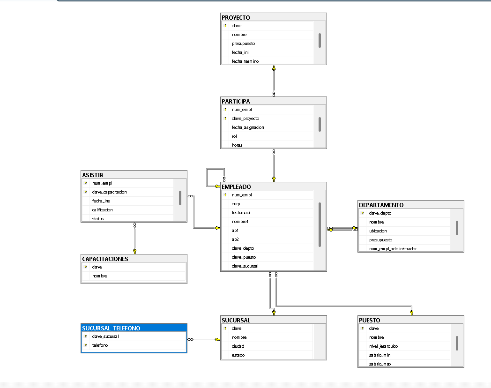

## Ejercicio 9

Control corporativo completo (Sucursal, Puesto, Empleado, Departamento, Capacitaciones, Proyecto):

> De cada sucursal se almacena:
- Clave (Primary Key)
- Nombre, ciudad y estado
- Teléfono (Atributo multivaluado)

> De cada puesto se almacena:
- Clave (Primary Key)
- Nombre y nivel jerárquico
- Salario mínimo y máximo

> De cada proyecto se almacena:
- Clave (Primary Key)
- Nombre, presupuesto, fecha de inicio y fecha de término

> De las capacitaciones se almacena:
- Clave (Primary Key)
- Nombre

> De cada departamento se almacena:
- Clave de departamento (Primary Key)
- Nombre, ubicación y presupuesto
- Administrador (Empleado a cargo)

> De cada empleado se almacena:
- Número de empleado (Primary Key)
- CURP (Único)
- Fecha de nacimiento
- Nombre y apellidos
- Departamento, puesto y sucursal asignados
- Jefe directo (Autorreferencia)

> De las relaciones (Participa / Asistir) se almacena:
- **Participa:** Fecha de asignación, rol y horas trabajadas en el proyecto
- **Asistir:** Fecha de inscripción, calificación y estatus en la capacitación

> ¿Qué se debe realizar?
- Identificar las entidades
- Identificar atributos
- Dibujar las relaciones
- Determinar la cardinalidad
- Determinar la participación de cada entidad


### Código SQL
```sql
CREATE DATABASE control_empresa;
GO

USE control_empresa;
GO

-- 1. SUCURSAL
CREATE TABLE SUCURSAL(
    clave INT PRIMARY KEY,
    nombre VARCHAR(100) NOT NULL,
    ciudad VARCHAR(100) NOT NULL,
    estado VARCHAR(100) NOT NULL
);
GO

-- Atributo multivaluado: telefono
CREATE TABLE SUCURSAL_TELEFONO(
    clave_sucursal INT NOT NULL,
    telefono VARCHAR(20) NOT NULL,
    PRIMARY KEY (clave_sucursal, telefono),
    FOREIGN KEY (clave_sucursal) REFERENCES SUCURSAL(clave)
);
GO

-- 2. PUESTO
CREATE TABLE PUESTO(
    clave INT PRIMARY KEY,
    nombre VARCHAR(100) NOT NULL,
    nivel_jerarquico INT NOT NULL,
    salario_min DECIMAL(10,2) NOT NULL,
    salario_max DECIMAL(10,2) NOT NULL
);
GO

-- 3. PROYECTO
CREATE TABLE PROYECTO(
    clave INT PRIMARY KEY,
    nombre VARCHAR(100) NOT NULL,
    presupuesto DECIMAL(12,2) NOT NULL,
    fecha_ini DATE NOT NULL,
    fecha_termino DATE
);
GO

-- 4. CAPACITACIONES
CREATE TABLE CAPACITACIONES(
    clave INT PRIMARY KEY,
    nombre VARCHAR(100) NOT NULL
);
GO

-- 5. DEPARTAMENTO
CREATE TABLE DEPARTAMENTO(
    clave_depto INT PRIMARY KEY,
    nombre VARCHAR(100) NOT NULL,
    ubicacion VARCHAR(100) NOT NULL,
    presupuesto DECIMAL(12,2) NOT NULL
);
GO

-- 6. EMPLEADO
CREATE TABLE EMPLEADO(
    num_empl INT PRIMARY KEY,
    curp CHAR(18) NOT NULL UNIQUE,
    fechanaci DATE NOT NULL,
    nombre1 VARCHAR(50) NOT NULL,
    ap1 VARCHAR(50) NOT NULL,
    ap2 VARCHAR(50),
    clave_depto INT NOT NULL,
    clave_puesto INT NOT NULL,
    clave_sucursal INT NOT NULL,
    num_empl_jefe INT,
    FOREIGN KEY (clave_depto) REFERENCES DEPARTAMENTO(clave_depto),
    FOREIGN KEY (clave_puesto) REFERENCES PUESTO(clave),
    FOREIGN KEY (clave_sucursal) REFERENCES SUCURSAL(clave),
    FOREIGN KEY (num_empl_jefe) REFERENCES EMPLEADO(num_empl)
);
GO

ALTER TABLE DEPARTAMENTO
ADD num_empl_administrador INT,
FOREIGN KEY (num_empl_administrador) REFERENCES EMPLEADO(num_empl);
GO

-- 7. PARTICIPA
CREATE TABLE PARTICIPA(
    num_empl INT NOT NULL,
    clave_proyecto INT NOT NULL,
    fecha_asignacion DATE NOT NULL,
    rol VARCHAR(50) NOT NULL,
    horas DECIMAL(4,1) NOT NULL,
    PRIMARY KEY (num_empl, clave_proyecto),
    FOREIGN KEY (num_empl) REFERENCES EMPLEADO(num_empl),
    FOREIGN KEY (clave_proyecto) REFERENCES PROYECTO(clave)
);
GO

-- 8. ASISTIR
CREATE TABLE ASISTIR(
    num_empl INT NOT NULL,
    clave_capacitacion INT NOT NULL,
    fecha_ins DATE NOT NULL,
    calificacion DECIMAL(4,2),
    status VARCHAR(50) NOT NULL,
    PRIMARY KEY (num_empl, clave_capacitacion),
    FOREIGN KEY (num_empl) REFERENCES EMPLEADO(num_empl),
    FOREIGN KEY (clave_capacitacion) REFERENCES CAPACITACIONES(clave)
);
GO
```

## Relacional


